physiHA deployed by ansible
Setup PVE:
<!-- DOCSIBLE START -->

# 📃 Role overview

## lae.proxmox


Description: Installs and configures Proxmox Virtual Environment 6.x/7.x on Debian servers.


| Field                | Value           |
|--------------------- |-----------------|
| Readme update2        | 16/07/2024 |

### Defaults

**These are static variables with lower priority**

#### File: main.yml


| Var          | Type         | Value       |Required    | Title       |
|--------------|--------------|-------------|-------------|-------------|
| [pve_group](defaults/main.yml#L3)   | str   | `proxmox`  |  n/a  |  n/a |
| [pve_repository_line](defaults/main.yml#L4)   | str   | `deb http://download.proxmox.com/debian/pve {{ ansible_distribution_release }} pve-no-subscription`  |  n/a  |  n/a |
| [pve_remove_subscription_warning](defaults/main.yml#L5)   | bool   | `True`  |  n/a  |  n/a |
| [pve_extra_packages](defaults/main.yml#L6)   | list   | `[]`  |  n/a  |  n/a |
| [pve_check_for_kernel_update](defaults/main.yml#L7)   | bool   | `True`  |  n/a  |  n/a |
| [pve_reboot_on_kernel_update](defaults/main.yml#L8)   | bool   | `False`  |  n/a  |  n/a |
| [pve_reboot_on_kernel_update_delay](defaults/main.yml#L9)   | int   | `60`  |  n/a  |  n/a |
| [pve_remove_old_kernels](defaults/main.yml#L10)   | bool   | `True`  |  n/a  |  n/a |
| [pve_run_system_upgrades](defaults/main.yml#L11)   | bool   | `False`  |  n/a  |  n/a |
| [pve_run_proxmox_upgrades](defaults/main.yml#L12)   | bool   | `True`  |  n/a  |  n/a |
| [pve_pcie_passthrough_enabled](defaults/main.yml#L13)   | bool   | `False`  |  n/a  |  n/a |
| [pve_iommu_passthrough_mode](defaults/main.yml#L14)   | bool   | `False`  |  n/a  |  n/a |
| [pve_iommu_unsafe_interrupts](defaults/main.yml#L15)   | bool   | `False`  |  n/a  |  n/a |
| [pve_mediated_devices_enabled](defaults/main.yml#L16)   | bool   | `False`  |  n/a  |  n/a |
| [pve_pcie_ovmf_enabled](defaults/main.yml#L17)   | bool   | `False`  |  n/a  |  n/a |
| [pve_pci_device_ids](defaults/main.yml#L18)   | list   | `[]`  |  n/a  |  n/a |
| [pve_vfio_blacklist_drivers](defaults/main.yml#L19)   | list   | `[]`  |  n/a  |  n/a |
| [pve_pcie_ignore_msrs](defaults/main.yml#L20)   | bool   | `False`  |  n/a  |  n/a |
| [pve_pcie_report_msrs](defaults/main.yml#L21)   | bool   | `True`  |  n/a  |  n/a |
| [pve_watchdog](defaults/main.yml#L22)   | str   | `none`  |  n/a  |  n/a |
| [pve_watchdog_ipmi_action](defaults/main.yml#L23)   | str   | `power_cycle`  |  n/a  |  n/a |
| [pve_watchdog_ipmi_timeout](defaults/main.yml#L24)   | int   | `10`  |  n/a  |  n/a |
| [pve_zfs_enabled](defaults/main.yml#L25)   | bool   | `False`  |  n/a  |  n/a |
| [pve_zfs_create_volumes](defaults/main.yml#L28)   | list   | `[]`  |  n/a  |  n/a |
| [pve_ceph_enabled](defaults/main.yml#L29)   | bool   | `False`  |  n/a  |  n/a |
| [pve_ceph_repository_line](defaults/main.yml#L30)   | str   | `deb http://download.proxmox.com/debian/ceph-nautilus busterceph-quincy bullseye main`  |  n/a  |  n/a |
| [pve_ceph_network](defaults/main.yml#L31)   | str   | `{{ (ansible_default_ipv4.network +'/'+ ansible_default_ipv4.netmask) \| ansible.utils.ipaddr('net') }}`  |  n/a  |  n/a |
| [pve_ceph_nodes](defaults/main.yml#L32)   | str   | `{{ pve_group }}`  |  n/a  |  n/a |
| [pve_ceph_mon_group](defaults/main.yml#L33)   | str   | `{{ pve_group }}`  |  n/a  |  n/a |
| [pve_ceph_mgr_group](defaults/main.yml#L34)   | str   | `{{ pve_ceph_mon_group }}`  |  n/a  |  n/a |
| [pve_ceph_mds_group](defaults/main.yml#L35)   | str   | `{{ pve_group }}`  |  n/a  |  n/a |
| [pve_ceph_osds](defaults/main.yml#L36)   | list   | `[]`  |  n/a  |  n/a |
| [pve_ceph_pools](defaults/main.yml#L37)   | list   | `[]`  |  n/a  |  n/a |
| [pve_ceph_fs](defaults/main.yml#L38)   | list   | `[]`  |  n/a  |  n/a |
| [pve_ceph_crush_rules](defaults/main.yml#L39)   | list   | `[]`  |  n/a  |  n/a |
| [pve_cluster_enabled](defaults/main.yml#L42)   | bool   | `False`  |  n/a  |  n/a |
| [pve_cluster_clustername](defaults/main.yml#L43)   | str   | `{{ pve_group }}`  |  n/a  |  n/a |
| [pve_manage_hosts_enabled](defaults/main.yml#L44)   | bool   | `True`  |  n/a  |  n/a |
| [pve_cluster_addr0](defaults/main.yml#L45)   | str   | `{{ ansible_default_ipv4.address if ansible_default_ipv4.address is defined else ansible_default_ipv6.address if ansible_default_ipv6.address is defined }}`  |  n/a  |  n/a |
| [pve_datacenter_cfg](defaults/main.yml#L49)   | dict   | `{}`  |  n/a  |  n/a |
| [pve_domains_cfg](defaults/main.yml#L50)   | list   | `[]`  |  n/a  |  n/a |
| [pve_cluster_ha_groups](defaults/main.yml#L51)   | list   | `[]`  |  n/a  |  n/a |
| [pve_pools](defaults/main.yml#L53)   | list   | `[]`  |  n/a  |  n/a |
| [pve_roles](defaults/main.yml#L54)   | list   | `[]`  |  n/a  |  n/a |
| [pve_groups](defaults/main.yml#L55)   | list   | `[]`  |  n/a  |  n/a |
| [pve_users](defaults/main.yml#L56)   | list   | `[]`  |  n/a  |  n/a |
| [pve_acls](defaults/main.yml#L57)   | list   | `[]`  |  n/a  |  n/a |
| [pve_storages](defaults/main.yml#L58)   | list   | `[]`  |  n/a  |  n/a |
| [pve_ssh_port](defaults/main.yml#L59)   | int   | `22`  |  n/a  |  n/a |
| [pve_manage_ssh](defaults/main.yml#L60)   | bool   | `True`  |  n/a  |  n/a |
| [pve_hooks](defaults/main.yml#L61)   | dict   | `{}`  |  n/a  |  n/a |
| [pve_no_log](defaults/main.yml#L62)   | bool   | `False`  |  n/a  |  n/a |


### Vars

**These are variables with higher priority**
#### File: debian-buster.yml


| Var          | Type         | Value       | Required    | Title       |
|--------------|--------------|-------------|-------------|-------------|
| [pve_release_key](vars/debian-buster.yml#L2)    | str   | `proxmox-ve-release-6.x.asc`  | n/a | n/a |
| [pve_release_key_id](vars/debian-buster.yml#L3)    | str   | `7BF2812E8A6E88E0`  | n/a | n/a |
| [pve_ssh_ciphers](vars/debian-buster.yml#L4)    | str   | `aes128-ctr,aes192-ctr,aes256-ctr,aes128-gcm@openssh.com,aes256-gcm@openssh.com,chacha20-poly1305@openssh.com`  | n/a | n/a |
#### File: main.yml


| Var          | Type         | Value       | Required    | Title       |
|--------------|--------------|-------------|-------------|-------------|
| [pve_base_dir](vars/main.yml#L3)    | str   | `/etc/pve`  | n/a | n/a |
| [pve_cluster_conf](vars/main.yml#L4)    | str   | `{{ pve_base_dir }}/corosync.conf`  | n/a | n/a |
#### File: debian-bookworm.yml


| Var          | Type         | Value       | Required    | Title       |
|--------------|--------------|-------------|-------------|-------------|
| [pve_ssh_ciphers](vars/debian-bookworm.yml#L2)    | str   | `aes128-ctr,aes192-ctr,aes256-ctr,aes128-gcm@openssh.com,aes256-gcm@openssh.com,chacha20-poly1305@openssh.com`  | n/a | n/a |
#### File: debian-bullseye.yml


| Var          | Type         | Value       | Required    | Title       |
|--------------|--------------|-------------|-------------|-------------|
| [pve_release_key](vars/debian-bullseye.yml#L2)    | str   | `proxmox-ve-release-7.x.asc`  | n/a | n/a |
| [pve_release_key_id](vars/debian-bullseye.yml#L3)    | str   | `DD4BA3917E23BF59`  | n/a | n/a |
| [pve_ssh_ciphers](vars/debian-bullseye.yml#L4)    | str   | `aes128-ctr,aes192-ctr,aes256-ctr,aes128-gcm@openssh.com,aes256-gcm@openssh.com,chacha20-poly1305@openssh.com`  | n/a | n/a |


### Tasks


#### File: kernel_module_cleanup.yml

| Name | Module | Has Conditions |
| ---- | ------ | --------- |
| Remove ZFS modprobe configuration | file | True |
| Disable loading of ZFS module on init | file | True |
| Unnamed_block | block | True |
| Re-enable nmi_watchdog via GRUB config | lineinfile | False |
| Remove ipmi_watchdog modprobe configuration | file | False |
| Load softdog | modprobe | False |
| Set PVE HA Manager watchdog configuration back to default | copy | False |
| Modify vfio IOMMU references and configuration in default grub | ansible.builtin.blockinfile | True |
| Remove modprobe.d configuration files | block | False |
| Remove vfio config file | ansible.builtin.file | True |
| Remove driver blacklist config file | ansible.builtin.file | True |
| Remove kvm config file | ansible.builtin.file | True |
| Disable declaring IOMMU unsafe interrupts on init | ansible.builtin.file | True |
| Remove all GVT-g configuration | block | False |
| Remove modules list for GVT-g | ansible.builtin.blockinfile | True |
| Remove modules list required for PCI passthrough | ansible.builtin.blockinfile | True |

#### File: kernel_updates.yml

| Name | Module | Has Conditions |
| ---- | ------ | --------- |
| Check for kernel update | collect_kernel_info | True |
| Reboot for kernel update | reboot | True |
| Collect kernel package information | collect_kernel_info | False |
| Remove old Debian/PVE kernels | apt | True |

#### File: main.yml

| Name | Module | Has Conditions |
| ---- | ------ | --------- |
| Unnamed | import_tasks | False |
| Gather package facts | package_facts | False |
| Ensure that facts are present for all cluster hosts | assert | True |
| Ensure that group has more than one host to enable PVE clustering | assert | True |
| Ensure this host is in the group specified | assert | True |
| Unnamed | import_tasks | True |
| Run handlers if needed (ssh server reload) | meta | False |
| Enumerate all cluster hosts within the hosts file | blockinfile | True |
| Remove conflicting lines in hosts files | lineinfile | True |
| Define hostname in /etc/hosts for single-host installations | lineinfile | True |
| Ensure gpg is installed | apt | False |
| Trust Proxmox' packaging key on Debian < 12 | apt_key | True |
| Trust Proxmox' packaging key on Debian 12 | copy | True |
| Remove os-prober package | apt | False |
| Add Proxmox repository | apt_repository | False |
| Add Proxmox Ceph repository | apt_repository | True |
| Run apt-get dist-upgrade on repository changes | apt | True |
| Perform system upgrades | apt | True |
| Unnamed | import_tasks | False |
| Install Proxmox VE and related packages | apt | False |
| Unnamed_block | block | True |
| Remove automatically installed PVE Enterprise repo configuration | apt_repository | False |
| Remove subscription check wrapper function in web UI | ansible.builtin.lineinfile | True |
| Unnamed | import_tasks | True |
| Unnamed | import_tasks | False |
| Unnamed | import_tasks | True |
| Unnamed | import_tasks | True |
| Unnamed | import_tasks | False |
| Unnamed | import_tasks | True |
| Unnamed | import_tasks | True |
| Configure Proxmox pools | proxmox_pool | True |
| Configure Proxmox roles | proxmox_role | True |
| Configure Proxmox groups | proxmox_group | True |
| Configure Proxmox user accounts | proxmox_user | True |
| Unnamed | import_tasks | True |
| Select ldap-based realms with sync | set_fact | False |
| Sync ldap-based realms | include_tasks | True |
| Configure Proxmox ACLs | proxmox_acl | True |
| Create ZFS Pools | zfs | True |
| Create ZFS Volumes specified by user | zfs | False |
| Configure Proxmox Storage | proxmox_storage | True |
| Check datacenter.cfg exists | stat | True |
| Create datacenter.cfg if it does not exist | file | True |
| Configure datacenter.cfg | copy | True |
| Check domains.cfg exists | stat | True |
| Create domains.cfg if it does not exist | file | True |
| Unnamed | import_tasks | True |

#### File: zfs.yml

| Name | Module | Has Conditions |
| ---- | ------ | --------- |
| Load ZFS module live | modprobe | False |
| Load ZFS module on init | copy | False |
| Copy ZFS modprobe configuration | copy | True |
| Configure email address for ZFS event daemon notifications | lineinfile | True |
| HOOK - Run ZFS post-install hook tasks | ansible.builtin.include_tasks | True |

#### File: identify_needed_packages.yml

| Name | Module | Has Conditions |
| ---- | ------ | --------- |
| Stage packages needed for base PVE installation | set_fact | False |
| Stage ZFS packages if ZFS is enabled | set_fact | True |
| Stage Ceph packages if Ceph is enabled | set_fact | True |
| Stage any extra packages the user has specified | set_fact | False |

#### File: disable_nmi_watchdog.yml

| Name | Module | Has Conditions |
| ---- | ------ | --------- |
| Unload nmi_watchdog | modprobe | False |
| Attempt to unload softdog live | modprobe | False |
| Unnamed_block | block | True |
| Stop watchdog-mux | service | False |
| Unload softdog | modprobe | False |
| Disable nmi_watchdog via GRUB config | lineinfile | False |

#### File: realms_sync.yml

| Name | Module | Has Conditions |
| ---- | ------ | --------- |
| Get pre-sync state of groups | ansible.builtin.shell | False |
| Get pre-sync state of users | ansible.builtin.shell | False |
| Sync ldap-based realm {{ pve_ldap_realm.name }} | ansible.builtin.shell | False |
| Get post-sync state of groups | ansible.builtin.shell | False |
| Get post-sync state of users | ansible.builtin.shell | False |
| Create temporary file for pre-post-sync comparation | ansible.builtin.tempfile | False |
| Save pre-sync state of groups and users | ansible.builtin.copy | True |
| Compare to post-sync state of groups and users for realm {{ pve_ldap_realm.name }} | ansible.builtin.copy | True |
| Remove the temporary file for pre-post-sync comparation | ansible.builtin.file | True |

#### File: ssh_cluster_config.yml

| Name | Module | Has Conditions |
| ---- | ------ | --------- |
| Create SSH directory for root | file | False |
| Create root SSH key pair for PVE | user | False |
| Fetch root SSH public key | slurp | False |
| Authorize all hosts' root SSH public keys | authorized_key | False |
| Configure SSH clients for connecting to PVE cluster hosts | blockinfile | False |
| Allow root logins from PVE cluster hosts | blockinfile | False |
| Enable and start SSH server | ansible.builtin.systemd | False |
| Fetch a SSH public key to use for cluster joins | ansible.builtin.slurp | False |
| Add PVE-provided ciphers to SSH client config | lineinfile | False |

#### File: pve_add_node.yml

| Name | Module | Has Conditions |
| ---- | ------ | --------- |
| Unnamed_block | block | True |
| Identify the SSH public key and SSH addresses of initial cluster host | ansible.builtin.set_fact | False |
| Temporarily mark that cluster host as known in root user's known_hosts | ansible.builtin.blockinfile | False |
| Add node to Proxmox cluster | ansible.builtin.command | False |
| Remove the cluster host's public key from root user's known_hosts | ansible.builtin.blockinfile | True |

#### File: load_variables.yml

| Name | Module | Has Conditions |
| ---- | ------ | --------- |
| Gather distribution specific variables | include_vars | False |
| Ensure pve_cluster_addr0 is in the host facts | set_fact | False |
| Calculate list of SSH addresses | set_fact | False |

#### File: ssl_config.yml

| Name | Module | Has Conditions |
| ---- | ------ | --------- |
| Copy PVE SSL certificate chain and key to /etc/ssl | copy | False |
| Install PVE SSL certificate chain and key | shell | False |

#### File: pcie_passthrough.yml

| Name | Module | Has Conditions |
| ---- | ------ | --------- |
| Modify vfio IOMMU references and configuration in default grub | ansible.builtin.blockinfile | True |
| Create/Modify modprobe.d configuration files | block | False |
| Specify vfio configuration options | ansible.builtin.blockinfile | True |
| Blacklist drivers from host | ansible.builtin.blockinfile | True |
| Specify kvm configuration options | ansible.builtin.blockinfile | True |
| Enable IOMMU Interrupt Remapping | ansible.builtin.blockinfile | True |
| Modify required modules list | block | False |
| Modify modules list for PCIe Passthrough | ansible.builtin.blockinfile | False |
| Modify modules list for GVT-g | ansible.builtin.blockinfile | True |

#### File: ceph.yml

| Name | Module | Has Conditions |
| ---- | ------ | --------- |
| Unnamed_block | block | True |
| Create initial Ceph config | command | False |
| Create initial Ceph monitor | command | False |
| Fail if initial monitor creation failed | fail | True |
| Create additional Ceph monitors | command | True |
| Create additional Ceph managers | command | True |
| Unnamed_block | block | False |
| Query for existing Ceph volumes | pve_ceph_volume | False |
| Generate a list of active OSDs | ansible.builtin.set_fact | False |
| Generate list of unprovisioned OSDs | ansible.builtin.set_fact | True |
| Create Ceph OSDs | ansible.builtin.command | False |
| Unnamed_block | block | True |
| List Ceph CRUSH rules | command | False |
| Create Ceph CRUSH rules | command | True |
| Unnamed_block | block | False |
| Download and decompress crushmap | command | False |
| Modify local crushmap for rules that should be updated | replace | False |
| Validate and compress new crushmap | command | True |
| Upload new crushmap | command | True |
| Cleanup temp files from generating new crushmap | file | False |
| List Ceph Pools | command | False |
| Create Ceph Pools | command | True |
| Create Ceph MDS servers | command | True |
| Wait for standby MDS | command | True |
| Unnamed_block | block | True |
| List Ceph Filesystems | command | True |
| Create Ceph Filesystems | command | True |
| Get Ceph Filesystem pool CRUSH rules | command | True |
| Set Ceph Filesystem pool CRUSH rules | command | True |
| Create Ceph filesystem key | command | True |
| Fetch Ceph filesystem key | command | True |
| Save Ceph filesystem key | copy | True |
| Mount Ceph filesystems | mount | True |

#### File: ipmi_watchdog.yml

| Name | Module | Has Conditions |
| ---- | ------ | --------- |
| Unnamed | import_tasks | False |
| Load ipmi_watchdog module | modprobe | False |
| Configure ipmi_watchdog module to load on boot | copy | False |
| Configure PVE HA Manager to use ipmi_watchdog | copy | False |

#### File: realms_config.yml

| Name | Module | Has Conditions |
| ---- | ------ | --------- |
| Check domains.cfg exists | stat | False |
| Create domains.cfg if it does not exist | file | True |
| Configure domains.cfg | copy | False |
| Select ldap-based realms with bind_password | set_fact | False |
| Ensure /etc/pve/priv/realm/ exists | ansible.builtin.file | True |
| Ensure ldap-based realm secret files exists | ansible.builtin.file | False |
| Update ldap-based realm secret files | ansible.builtin.copy | False |

#### File: pve_cluster_config.yml

| Name | Module | Has Conditions |
| ---- | ------ | --------- |
| Lookup cluster information | proxmox_query | False |
| Identify if the host is already part of a cluster | set_fact | True |
| Identify all clusters that the hosts in the specified group may be in | set_fact | True |
| Ensure that hosts found are not in multiple existing clusters | assert | False |
| Ensure that, if we find an existing cluster, that it matches the specified cluster name | assert | True |
| Default initialization node is the first node of pve_group | ansible.builtin.set_fact | False |
| Find any active node in an already initialized Proxmox cluster | ansible.builtin.set_fact | True |
| Initialize a Proxmox cluster | ansible.builtin.command | True |
| Wait for quorum on initialization node | proxmox_query | True |
| Unnamed | include_tasks | True |
| Check for PVE cluster HA groups | proxmox_query | True |
| Create PVE cluster HA groups | command | True |
| Update PVE cluster HA groups | command | True |


## Task Flow Graphs


### Graph for kernel_module_cleanup.yml

```mermaid
flowchart TD
Start
classDef block stroke:#3498db,stroke-width:2px;
classDef task stroke:#4b76bb,stroke-width:2px;
classDef include stroke:#2ecc71,stroke-width:2px;
classDef import stroke:#f39c12,stroke-width:2px;
classDef rescue stroke:#665352,stroke-width:2px;
classDef importPlaybook stroke:#9b59b6,stroke-width:2px;
classDef importTasks stroke:#34495e,stroke-width:2px;
classDef includeTasks stroke:#16a085,stroke-width:2px;
classDef importRole stroke:#699ba7,stroke-width:2px;
classDef includeRole stroke:#2980b9,stroke-width:2px;
classDef includeVars stroke:#8e44ad,stroke-width:2px;

  Start-->|Task| Remove_ZFS_modprobe_configuration0_when__pve_zfs_options_is_not_defined__or__pve_zfs_options_is_defined_and_not_pve_zfs_options___length___0__or__not_pve_zfs_enabled___bool__[remove zfs modprobe configuration]:::task
  Remove_ZFS_modprobe_configuration0_when__pve_zfs_options_is_not_defined__or__pve_zfs_options_is_defined_and_not_pve_zfs_options___length___0__or__not_pve_zfs_enabled___bool__---|When:  pve zfs options is not defined  or  pve zfs<br>options is defined and not pve zfs options  <br>length   0  or  not pve zfs enabled   bool  | Remove_ZFS_modprobe_configuration0_when__pve_zfs_options_is_not_defined__or__pve_zfs_options_is_defined_and_not_pve_zfs_options___length___0__or__not_pve_zfs_enabled___bool__
  Remove_ZFS_modprobe_configuration0_when__pve_zfs_options_is_not_defined__or__pve_zfs_options_is_defined_and_not_pve_zfs_options___length___0__or__not_pve_zfs_enabled___bool__-->|Task| Disable_loading_of_ZFS_module_on_init1_when_not_pve_zfs_enabled___bool[disable loading of zfs module on init]:::task
  Disable_loading_of_ZFS_module_on_init1_when_not_pve_zfs_enabled___bool---|When: not pve zfs enabled   bool| Disable_loading_of_ZFS_module_on_init1_when_not_pve_zfs_enabled___bool
  Disable_loading_of_ZFS_module_on_init1_when_not_pve_zfs_enabled___bool-->|"Block Start (When: pve watchdog     ipmi )"| Unnamed_task_22_when_pve_watchdog_____ipmi__block_start_0[[unnamed task 2]]:::block
  Unnamed_task_22_when_pve_watchdog_____ipmi__block_start_0-->|Task| Re_enable_nmi_watchdog_via_GRUB_config0[re enable nmi watchdog via grub config]:::task
  Re_enable_nmi_watchdog_via_GRUB_config0-->|Task| Remove_ipmi_watchdog_modprobe_configuration1[remove ipmi watchdog modprobe configuration]:::task
  Remove_ipmi_watchdog_modprobe_configuration1-->|Task| Load_softdog2[load softdog]:::task
  Load_softdog2-->|Task| Set_PVE_HA_Manager_watchdog_configuration_back_to_default3[set pve ha manager watchdog configuration back to<br>default]:::task
  Set_PVE_HA_Manager_watchdog_configuration_back_to_default3-.->|End of Block| Unnamed_task_22_when_pve_watchdog_____ipmi__block_start_0
  Set_PVE_HA_Manager_watchdog_configuration_back_to_default3-->|Task| Modify_vfio_IOMMU_references_and_configuration_in_default_grub3_when__not_pve_pcie_passthrough_enabled___bool__or___not__GenuineIntel__in_ansible_processor___unique__and__not_pve_iommu_passthrough_mode___bool__and__not_pve_mediated_devices_enabled___bool__and__not_pve_pci_device_ids___length___0___[modify vfio iommu references and configuration in<br>default grub]:::task
  Modify_vfio_IOMMU_references_and_configuration_in_default_grub3_when__not_pve_pcie_passthrough_enabled___bool__or___not__GenuineIntel__in_ansible_processor___unique__and__not_pve_iommu_passthrough_mode___bool__and__not_pve_mediated_devices_enabled___bool__and__not_pve_pci_device_ids___length___0___---|When:  not pve pcie passthrough enabled   bool  or   not<br> genuineintel  in ansible processor   unique  and <br>not pve iommu passthrough mode   bool  and  not<br>pve mediated devices enabled   bool  and  not pve<br>pci device ids   length   0   | Modify_vfio_IOMMU_references_and_configuration_in_default_grub3_when__not_pve_pcie_passthrough_enabled___bool__or___not__GenuineIntel__in_ansible_processor___unique__and__not_pve_iommu_passthrough_mode___bool__and__not_pve_mediated_devices_enabled___bool__and__not_pve_pci_device_ids___length___0___
  Modify_vfio_IOMMU_references_and_configuration_in_default_grub3_when__not_pve_pcie_passthrough_enabled___bool__or___not__GenuineIntel__in_ansible_processor___unique__and__not_pve_iommu_passthrough_mode___bool__and__not_pve_mediated_devices_enabled___bool__and__not_pve_pci_device_ids___length___0___-->|Block Start| Remove_modprobe_d_configuration_files4_block_start_0[[remove modprobe d configuration files]]:::block
  Remove_modprobe_d_configuration_files4_block_start_0-->|Task| Remove_vfio_config_file0_when__not_pve_pcie_passthrough_enabled___bool__or___not_pve_pci_device_ids___length___0__and__not_pve_vfio_blacklist_drivers___length___0__and__not_pve_pcie_ovmf_enabled___bool___[remove vfio config file]:::task
  Remove_vfio_config_file0_when__not_pve_pcie_passthrough_enabled___bool__or___not_pve_pci_device_ids___length___0__and__not_pve_vfio_blacklist_drivers___length___0__and__not_pve_pcie_ovmf_enabled___bool___---|When:  not pve pcie passthrough enabled   bool  or   not<br>pve pci device ids   length   0  and  not pve vfio<br>blacklist drivers   length   0  and  not pve pcie<br>ovmf enabled   bool   | Remove_vfio_config_file0_when__not_pve_pcie_passthrough_enabled___bool__or___not_pve_pci_device_ids___length___0__and__not_pve_vfio_blacklist_drivers___length___0__and__not_pve_pcie_ovmf_enabled___bool___
  Remove_vfio_config_file0_when__not_pve_pcie_passthrough_enabled___bool__or___not_pve_pci_device_ids___length___0__and__not_pve_vfio_blacklist_drivers___length___0__and__not_pve_pcie_ovmf_enabled___bool___-->|Task| Remove_driver_blacklist_config_file1_when__not_pve_pcie_passthrough_enabled___bool__or__not_pve_vfio_blacklist_drivers___length___0__[remove driver blacklist config file]:::task
  Remove_driver_blacklist_config_file1_when__not_pve_pcie_passthrough_enabled___bool__or__not_pve_vfio_blacklist_drivers___length___0__---|When:  not pve pcie passthrough enabled   bool  or  not<br>pve vfio blacklist drivers   length   0  | Remove_driver_blacklist_config_file1_when__not_pve_pcie_passthrough_enabled___bool__or__not_pve_vfio_blacklist_drivers___length___0__
  Remove_driver_blacklist_config_file1_when__not_pve_pcie_passthrough_enabled___bool__or__not_pve_vfio_blacklist_drivers___length___0__-->|Task| Remove_kvm_config_file2_when__not_pve_pcie_passthrough_enabled___bool__or___not_pve_pcie_ignore_msrs___bool__and__pve_pcie_report_msrs___bool___[remove kvm config file]:::task
  Remove_kvm_config_file2_when__not_pve_pcie_passthrough_enabled___bool__or___not_pve_pcie_ignore_msrs___bool__and__pve_pcie_report_msrs___bool___---|When:  not pve pcie passthrough enabled   bool  or   not<br>pve pcie ignore msrs   bool  and  pve pcie report<br>msrs   bool   | Remove_kvm_config_file2_when__not_pve_pcie_passthrough_enabled___bool__or___not_pve_pcie_ignore_msrs___bool__and__pve_pcie_report_msrs___bool___
  Remove_kvm_config_file2_when__not_pve_pcie_passthrough_enabled___bool__or___not_pve_pcie_ignore_msrs___bool__and__pve_pcie_report_msrs___bool___-->|Task| Disable_declaring_IOMMU_unsafe_interrupts_on_init3_when__not_pve_pcie_passthrough_enabled___bool__or__not_pve_iommu_unsafe_interrupts___bool__[disable declaring iommu unsafe interrupts on init]:::task
  Disable_declaring_IOMMU_unsafe_interrupts_on_init3_when__not_pve_pcie_passthrough_enabled___bool__or__not_pve_iommu_unsafe_interrupts___bool__---|When:  not pve pcie passthrough enabled   bool  or  not<br>pve iommu unsafe interrupts   bool  | Disable_declaring_IOMMU_unsafe_interrupts_on_init3_when__not_pve_pcie_passthrough_enabled___bool__or__not_pve_iommu_unsafe_interrupts___bool__
  Disable_declaring_IOMMU_unsafe_interrupts_on_init3_when__not_pve_pcie_passthrough_enabled___bool__or__not_pve_iommu_unsafe_interrupts___bool__-.->|End of Block| Remove_modprobe_d_configuration_files4_block_start_0
  Disable_declaring_IOMMU_unsafe_interrupts_on_init3_when__not_pve_pcie_passthrough_enabled___bool__or__not_pve_iommu_unsafe_interrupts___bool__-->|Block Start| Remove_all_GVT_g_configuration5_block_start_0[[remove all gvt g configuration]]:::block
  Remove_all_GVT_g_configuration5_block_start_0-->|Task| Remove_modules_list_for_GVT_g0_when__not_pve_pcie_passthrough_enabled___bool__or__not_pve_mediated_devices_enabled___bool__[remove modules list for gvt g]:::task
  Remove_modules_list_for_GVT_g0_when__not_pve_pcie_passthrough_enabled___bool__or__not_pve_mediated_devices_enabled___bool__---|When:  not pve pcie passthrough enabled   bool  or  not<br>pve mediated devices enabled   bool  | Remove_modules_list_for_GVT_g0_when__not_pve_pcie_passthrough_enabled___bool__or__not_pve_mediated_devices_enabled___bool__
  Remove_modules_list_for_GVT_g0_when__not_pve_pcie_passthrough_enabled___bool__or__not_pve_mediated_devices_enabled___bool__-->|Task| Remove_modules_list_required_for_PCI_passthrough1_when__not_pve_pcie_passthrough_enabled___bool__[remove modules list required for pci passthrough]:::task
  Remove_modules_list_required_for_PCI_passthrough1_when__not_pve_pcie_passthrough_enabled___bool__---|When:  not pve pcie passthrough enabled   bool  | Remove_modules_list_required_for_PCI_passthrough1_when__not_pve_pcie_passthrough_enabled___bool__
  Remove_modules_list_required_for_PCI_passthrough1_when__not_pve_pcie_passthrough_enabled___bool__-.->|End of Block| Remove_all_GVT_g_configuration5_block_start_0
  Remove_modules_list_required_for_PCI_passthrough1_when__not_pve_pcie_passthrough_enabled___bool__-->End
```


### Graph for kernel_updates.yml

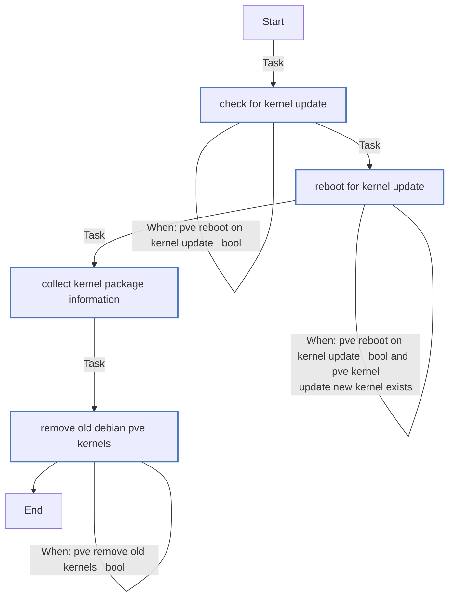


### Graph for main.yml

```mermaid
flowchart TD
Start
classDef block stroke:#3498db,stroke-width:2px;
classDef task stroke:#4b76bb,stroke-width:2px;
classDef include stroke:#2ecc71,stroke-width:2px;
classDef import stroke:#f39c12,stroke-width:2px;
classDef rescue stroke:#665352,stroke-width:2px;
classDef importPlaybook stroke:#9b59b6,stroke-width:2px;
classDef importTasks stroke:#34495e,stroke-width:2px;
classDef includeTasks stroke:#16a085,stroke-width:2px;
classDef importRole stroke:#699ba7,stroke-width:2px;
classDef includeRole stroke:#2980b9,stroke-width:2px;
classDef includeVars stroke:#8e44ad,stroke-width:2px;

  Start-->|Import task| load_variables_yml0[/unnamed task 0<br>import_task: load_variables_yml/]:::importTasks
  load_variables_yml0-->|Task| Gather_package_facts1[gather package facts]:::task
  Gather_package_facts1-->|Task| Ensure_that_facts_are_present_for_all_cluster_hosts2_when_pve_cluster_enabled___bool[ensure that facts are present for all cluster<br>hosts]:::task
  Ensure_that_facts_are_present_for_all_cluster_hosts2_when_pve_cluster_enabled___bool---|When: pve cluster enabled   bool| Ensure_that_facts_are_present_for_all_cluster_hosts2_when_pve_cluster_enabled___bool
  Ensure_that_facts_are_present_for_all_cluster_hosts2_when_pve_cluster_enabled___bool-->|Task| Ensure_that_group_has_more_than_one_host_to_enable_PVE_clustering3_when_pve_cluster_enabled___bool[ensure that group has more than one host to enable<br>pve clustering]:::task
  Ensure_that_group_has_more_than_one_host_to_enable_PVE_clustering3_when_pve_cluster_enabled___bool---|When: pve cluster enabled   bool| Ensure_that_group_has_more_than_one_host_to_enable_PVE_clustering3_when_pve_cluster_enabled___bool
  Ensure_that_group_has_more_than_one_host_to_enable_PVE_clustering3_when_pve_cluster_enabled___bool-->|Task| Ensure_this_host_is_in_the_group_specified4_when_pve_cluster_enabled___bool[ensure this host is in the group specified]:::task
  Ensure_this_host_is_in_the_group_specified4_when_pve_cluster_enabled___bool---|When: pve cluster enabled   bool| Ensure_this_host_is_in_the_group_specified4_when_pve_cluster_enabled___bool
  Ensure_this_host_is_in_the_group_specified4_when_pve_cluster_enabled___bool-->|Import task| ssh_cluster_config_yml5[/unnamed task 5<br>import_task: ssh_cluster_config_yml/]:::importTasks
  ssh_cluster_config_yml5---|When: pve manage ssh   bool and pve cluster enabled  <br>bool| ssh_cluster_config_yml5
  ssh_cluster_config_yml5-->|Task| Run_handlers_if_needed__ssh_server_reload_6[run handlers if needed  ssh server reload ]:::task
  Run_handlers_if_needed__ssh_server_reload_6-->|Task| Enumerate_all_cluster_hosts_within_the_hosts_file7_when_pve_cluster_enabled___bool_and_pve_manage_hosts_enabled___bool[enumerate all cluster hosts within the hosts file]:::task
  Enumerate_all_cluster_hosts_within_the_hosts_file7_when_pve_cluster_enabled___bool_and_pve_manage_hosts_enabled___bool---|When: pve cluster enabled   bool and pve manage hosts<br>enabled   bool| Enumerate_all_cluster_hosts_within_the_hosts_file7_when_pve_cluster_enabled___bool_and_pve_manage_hosts_enabled___bool
  Enumerate_all_cluster_hosts_within_the_hosts_file7_when_pve_cluster_enabled___bool_and_pve_manage_hosts_enabled___bool-->|Task| Remove_conflicting_lines_in_hosts_files8_when_pve_cluster_enabled___bool_and_pve_manage_hosts_enabled___bool[remove conflicting lines in hosts files]:::task
  Remove_conflicting_lines_in_hosts_files8_when_pve_cluster_enabled___bool_and_pve_manage_hosts_enabled___bool---|When: pve cluster enabled   bool and pve manage hosts<br>enabled   bool| Remove_conflicting_lines_in_hosts_files8_when_pve_cluster_enabled___bool_and_pve_manage_hosts_enabled___bool
  Remove_conflicting_lines_in_hosts_files8_when_pve_cluster_enabled___bool_and_pve_manage_hosts_enabled___bool-->|Task| Define_hostname_in__etc_hosts_for_single_host_installations9_when_not_pve_cluster_enabled___bool_and_pve_manage_hosts_enabled___bool[define hostname in  etc hosts for single host<br>installations]:::task
  Define_hostname_in__etc_hosts_for_single_host_installations9_when_not_pve_cluster_enabled___bool_and_pve_manage_hosts_enabled___bool---|When: not pve cluster enabled   bool and pve manage<br>hosts enabled   bool| Define_hostname_in__etc_hosts_for_single_host_installations9_when_not_pve_cluster_enabled___bool_and_pve_manage_hosts_enabled___bool
  Define_hostname_in__etc_hosts_for_single_host_installations9_when_not_pve_cluster_enabled___bool_and_pve_manage_hosts_enabled___bool-->|Task| Ensure_gpg_is_installed10[ensure gpg is installed]:::task
  Ensure_gpg_is_installed10-->|Task| Trust_Proxmox__packaging_key_on_Debian___1211_when_ansible_distribution_major_version___int___12[trust proxmox  packaging key on debian   12]:::task
  Trust_Proxmox__packaging_key_on_Debian___1211_when_ansible_distribution_major_version___int___12---|When: ansible distribution major version   int   12| Trust_Proxmox__packaging_key_on_Debian___1211_when_ansible_distribution_major_version___int___12
  Trust_Proxmox__packaging_key_on_Debian___1211_when_ansible_distribution_major_version___int___12-->|Task| Trust_Proxmox__packaging_key_on_Debian_1212_when_ansible_distribution_major_version___int____12[trust proxmox  packaging key on debian 12]:::task
  Trust_Proxmox__packaging_key_on_Debian_1212_when_ansible_distribution_major_version___int____12---|When: ansible distribution major version   int    12| Trust_Proxmox__packaging_key_on_Debian_1212_when_ansible_distribution_major_version___int____12
  Trust_Proxmox__packaging_key_on_Debian_1212_when_ansible_distribution_major_version___int____12-->|Task| Remove_os_prober_package13[remove os prober package]:::task
  Remove_os_prober_package13-->|Task| Add_Proxmox_repository14[add proxmox repository]:::task
  Add_Proxmox_repository14-->|Task| Add_Proxmox_Ceph_repository15_when_pve_ceph_enabled___bool[add proxmox ceph repository]:::task
  Add_Proxmox_Ceph_repository15_when_pve_ceph_enabled___bool---|When: pve ceph enabled   bool| Add_Proxmox_Ceph_repository15_when_pve_ceph_enabled___bool
  Add_Proxmox_Ceph_repository15_when_pve_ceph_enabled___bool-->|Task| Run_apt_get_dist_upgrade_on_repository_changes16_when__pve_repo_is_changed_or__pve_ceph_repo_is_changed[run apt get dist upgrade on repository changes]:::task
  Run_apt_get_dist_upgrade_on_repository_changes16_when__pve_repo_is_changed_or__pve_ceph_repo_is_changed---|When:  pve repo is changed or  pve ceph repo is changed| Run_apt_get_dist_upgrade_on_repository_changes16_when__pve_repo_is_changed_or__pve_ceph_repo_is_changed
  Run_apt_get_dist_upgrade_on_repository_changes16_when__pve_repo_is_changed_or__pve_ceph_repo_is_changed-->|Task| Perform_system_upgrades17_when_pve_run_system_upgrades___bool[perform system upgrades]:::task
  Perform_system_upgrades17_when_pve_run_system_upgrades___bool---|When: pve run system upgrades   bool| Perform_system_upgrades17_when_pve_run_system_upgrades___bool
  Perform_system_upgrades17_when_pve_run_system_upgrades___bool-->|Import task| identify_needed_packages_yml18[/unnamed task 18<br>import_task: identify_needed_packages_yml/]:::importTasks
  identify_needed_packages_yml18-->|Task| Install_Proxmox_VE_and_related_packages19[install proxmox ve and related packages]:::task
  Install_Proxmox_VE_and_related_packages19-->|"Block Start (When:  pve no subscription  in pve repository line)"| Unnamed_task_2020_when__pve_no_subscription__in_pve_repository_line_block_start_0[[unnamed task 20]]:::block
  Unnamed_task_2020_when__pve_no_subscription__in_pve_repository_line_block_start_0-->|Task| Remove_automatically_installed_PVE_Enterprise_repo_configuration0[remove automatically installed pve enterprise repo<br>configuration]:::task
  Remove_automatically_installed_PVE_Enterprise_repo_configuration0-->|Task| Remove_subscription_check_wrapper_function_in_web_UI1_when_pve_remove_subscription_warning___bool[remove subscription check wrapper function in web<br>ui]:::task
  Remove_subscription_check_wrapper_function_in_web_UI1_when_pve_remove_subscription_warning___bool---|When: pve remove subscription warning   bool| Remove_subscription_check_wrapper_function_in_web_UI1_when_pve_remove_subscription_warning___bool
  Remove_subscription_check_wrapper_function_in_web_UI1_when_pve_remove_subscription_warning___bool-.->|End of Block| Unnamed_task_2020_when__pve_no_subscription__in_pve_repository_line_block_start_0
  Remove_subscription_check_wrapper_function_in_web_UI1_when_pve_remove_subscription_warning___bool-->|Import task| pcie_passthrough_yml21[/unnamed task 21<br>import_task: pcie_passthrough_yml/]:::importTasks
  pcie_passthrough_yml21---|When: pve pcie passthrough enabled   bool| pcie_passthrough_yml21
  pcie_passthrough_yml21-->|Import task| kernel_updates_yml22[/unnamed task 22<br>import_task: kernel_updates_yml/]:::importTasks
  kernel_updates_yml22-->|Import task| ipmi_watchdog_yml23[/unnamed task 23<br>import_task: ipmi_watchdog_yml/]:::importTasks
  ipmi_watchdog_yml23---|When: pve watchdog     ipmi | ipmi_watchdog_yml23
  ipmi_watchdog_yml23-->|Import task| zfs_yml24[/unnamed task 24<br>import_task: zfs_yml/]:::importTasks
  zfs_yml24---|When: pve zfs enabled   bool| zfs_yml24
  zfs_yml24-->|Import task| kernel_module_cleanup_yml25[/unnamed task 25<br>import_task: kernel_module_cleanup_yml/]:::importTasks
  kernel_module_cleanup_yml25-->|Import task| pve_cluster_config_yml26[/unnamed task 26<br>import_task: pve_cluster_config_yml/]:::importTasks
  pve_cluster_config_yml26---|When: pve cluster enabled   bool| pve_cluster_config_yml26
  pve_cluster_config_yml26-->|Import task| ceph_yml27[/unnamed task 27<br>import_task: ceph_yml/]:::importTasks
  ceph_yml27---|When: pve ceph enabled   bool and inventory hostname in<br>groups pve ceph nodes | ceph_yml27
  ceph_yml27-->|Task| Configure_Proxmox_pools28_when_not_pve_cluster_enabled_or__pve_cluster_enabled___bool_and_inventory_hostname_____init_node_[configure proxmox pools]:::task
  Configure_Proxmox_pools28_when_not_pve_cluster_enabled_or__pve_cluster_enabled___bool_and_inventory_hostname_____init_node_---|When: not pve cluster enabled or  pve cluster enabled  <br>bool and inventory hostname     init node | Configure_Proxmox_pools28_when_not_pve_cluster_enabled_or__pve_cluster_enabled___bool_and_inventory_hostname_____init_node_
  Configure_Proxmox_pools28_when_not_pve_cluster_enabled_or__pve_cluster_enabled___bool_and_inventory_hostname_____init_node_-->|Task| Configure_Proxmox_roles29_when_not_pve_cluster_enabled___bool_or__pve_cluster_enabled___bool_and_inventory_hostname_____init_node_[configure proxmox roles]:::task
  Configure_Proxmox_roles29_when_not_pve_cluster_enabled___bool_or__pve_cluster_enabled___bool_and_inventory_hostname_____init_node_---|When: not pve cluster enabled   bool or  pve cluster<br>enabled   bool and inventory hostname     init<br>node | Configure_Proxmox_roles29_when_not_pve_cluster_enabled___bool_or__pve_cluster_enabled___bool_and_inventory_hostname_____init_node_
  Configure_Proxmox_roles29_when_not_pve_cluster_enabled___bool_or__pve_cluster_enabled___bool_and_inventory_hostname_____init_node_-->|Task| Configure_Proxmox_groups30_when_not_pve_cluster_enabled_or__pve_cluster_enabled___bool_and_inventory_hostname_____init_node_[configure proxmox groups]:::task
  Configure_Proxmox_groups30_when_not_pve_cluster_enabled_or__pve_cluster_enabled___bool_and_inventory_hostname_____init_node_---|When: not pve cluster enabled or  pve cluster enabled  <br>bool and inventory hostname     init node | Configure_Proxmox_groups30_when_not_pve_cluster_enabled_or__pve_cluster_enabled___bool_and_inventory_hostname_____init_node_
  Configure_Proxmox_groups30_when_not_pve_cluster_enabled_or__pve_cluster_enabled___bool_and_inventory_hostname_____init_node_-->|Task| Configure_Proxmox_user_accounts31_when_not_pve_cluster_enabled___bool_or__pve_cluster_enabled___bool_and_inventory_hostname_____init_node_[configure proxmox user accounts]:::task
  Configure_Proxmox_user_accounts31_when_not_pve_cluster_enabled___bool_or__pve_cluster_enabled___bool_and_inventory_hostname_____init_node_---|When: not pve cluster enabled   bool or  pve cluster<br>enabled   bool and inventory hostname     init<br>node | Configure_Proxmox_user_accounts31_when_not_pve_cluster_enabled___bool_or__pve_cluster_enabled___bool_and_inventory_hostname_____init_node_
  Configure_Proxmox_user_accounts31_when_not_pve_cluster_enabled___bool_or__pve_cluster_enabled___bool_and_inventory_hostname_____init_node_-->|Import task| realms_config_yml32[/unnamed task 32<br>import_task: realms_config_yml/]:::importTasks
  realms_config_yml32---|When: not pve cluster enabled   bool or  pve cluster<br>enabled and inventory hostname    groups pve group<br> 0   and pve domains cfg   length   0| realms_config_yml32
  realms_config_yml32-->|Task| Select_ldap_based_realms_with_sync33[select ldap based realms with sync]:::task
  Select_ldap_based_realms_with_sync33-->|Include task| realms_sync_yml34[\sync ldap based realms<br>include_task: realms_sync_yml\]:::includeTasks
  realms_sync_yml34---|When: not pve cluster enabled   bool or  pve cluster<br>enabled and inventory hostname    groups pve group<br> 0   and pve domains cfg   length   0 and pve ldap<br>realm sync   bool| realms_sync_yml34
  realms_sync_yml34-->|Task| Configure_Proxmox_ACLs35_when_not_pve_cluster_enabled___bool_or__pve_cluster_enabled___bool_and_inventory_hostname_____init_node_[configure proxmox acls]:::task
  Configure_Proxmox_ACLs35_when_not_pve_cluster_enabled___bool_or__pve_cluster_enabled___bool_and_inventory_hostname_____init_node_---|When: not pve cluster enabled   bool or  pve cluster<br>enabled   bool and inventory hostname     init<br>node | Configure_Proxmox_ACLs35_when_not_pve_cluster_enabled___bool_or__pve_cluster_enabled___bool_and_inventory_hostname_____init_node_
  Configure_Proxmox_ACLs35_when_not_pve_cluster_enabled___bool_or__pve_cluster_enabled___bool_and_inventory_hostname_____init_node_-->|Task| Create_ZFS_Pools36_when_item_type_____zfspool_[create zfs pools]:::task
  Create_ZFS_Pools36_when_item_type_____zfspool_---|When: item type     zfspool | Create_ZFS_Pools36_when_item_type_____zfspool_
  Create_ZFS_Pools36_when_item_type_____zfspool_-->|Task| Create_ZFS_Volumes_specified_by_user37[create zfs volumes specified by user]:::task
  Create_ZFS_Volumes_specified_by_user37-->|Task| Configure_Proxmox_Storage38_when_not_pve_cluster_enabled___bool_or__pve_cluster_enabled___bool_and_inventory_hostname_____init_node_[configure proxmox storage]:::task
  Configure_Proxmox_Storage38_when_not_pve_cluster_enabled___bool_or__pve_cluster_enabled___bool_and_inventory_hostname_____init_node_---|When: not pve cluster enabled   bool or  pve cluster<br>enabled   bool and inventory hostname     init<br>node | Configure_Proxmox_Storage38_when_not_pve_cluster_enabled___bool_or__pve_cluster_enabled___bool_and_inventory_hostname_____init_node_
  Configure_Proxmox_Storage38_when_not_pve_cluster_enabled___bool_or__pve_cluster_enabled___bool_and_inventory_hostname_____init_node_-->|Task| Check_datacenter_cfg_exists39_when_not_pve_cluster_enabled___bool_or__pve_cluster_enabled___bool_and_inventory_hostname_____init_node__AND_pve_datacenter_cfg___length___0[check datacenter cfg exists]:::task
  Check_datacenter_cfg_exists39_when_not_pve_cluster_enabled___bool_or__pve_cluster_enabled___bool_and_inventory_hostname_____init_node__AND_pve_datacenter_cfg___length___0---|When: not pve cluster enabled   bool or  pve cluster<br>enabled   bool and inventory hostname     init<br>node  and pve datacenter cfg   length   0| Check_datacenter_cfg_exists39_when_not_pve_cluster_enabled___bool_or__pve_cluster_enabled___bool_and_inventory_hostname_____init_node__AND_pve_datacenter_cfg___length___0
  Check_datacenter_cfg_exists39_when_not_pve_cluster_enabled___bool_or__pve_cluster_enabled___bool_and_inventory_hostname_____init_node__AND_pve_datacenter_cfg___length___0-->|Task| Create_datacenter_cfg_if_it_does_not_exist40_when_not_pve_cluster_enabled___bool_or__pve_cluster_enabled___bool_and_inventory_hostname_____init_node__AND_pve_datacenter_cfg___length___0_AND_not__datacenter_cfg_stat_exists[create datacenter cfg if it does not exist]:::task
  Create_datacenter_cfg_if_it_does_not_exist40_when_not_pve_cluster_enabled___bool_or__pve_cluster_enabled___bool_and_inventory_hostname_____init_node__AND_pve_datacenter_cfg___length___0_AND_not__datacenter_cfg_stat_exists---|When: not pve cluster enabled   bool or  pve cluster<br>enabled   bool and inventory hostname     init<br>node  and pve datacenter cfg   length   0 and not <br>datacenter cfg stat exists| Create_datacenter_cfg_if_it_does_not_exist40_when_not_pve_cluster_enabled___bool_or__pve_cluster_enabled___bool_and_inventory_hostname_____init_node__AND_pve_datacenter_cfg___length___0_AND_not__datacenter_cfg_stat_exists
  Create_datacenter_cfg_if_it_does_not_exist40_when_not_pve_cluster_enabled___bool_or__pve_cluster_enabled___bool_and_inventory_hostname_____init_node__AND_pve_datacenter_cfg___length___0_AND_not__datacenter_cfg_stat_exists-->|Task| Configure_datacenter_cfg41_when_not_pve_cluster_enabled___bool_or__pve_cluster_enabled___bool_and_inventory_hostname_____init_node__AND_pve_datacenter_cfg___length___0[configure datacenter cfg]:::task
  Configure_datacenter_cfg41_when_not_pve_cluster_enabled___bool_or__pve_cluster_enabled___bool_and_inventory_hostname_____init_node__AND_pve_datacenter_cfg___length___0---|When: not pve cluster enabled   bool or  pve cluster<br>enabled   bool and inventory hostname     init<br>node  and pve datacenter cfg   length   0| Configure_datacenter_cfg41_when_not_pve_cluster_enabled___bool_or__pve_cluster_enabled___bool_and_inventory_hostname_____init_node__AND_pve_datacenter_cfg___length___0
  Configure_datacenter_cfg41_when_not_pve_cluster_enabled___bool_or__pve_cluster_enabled___bool_and_inventory_hostname_____init_node__AND_pve_datacenter_cfg___length___0-->|Task| Check_domains_cfg_exists42_when_not_pve_cluster_enabled_or__pve_cluster_enabled_and_inventory_hostname____groups_pve_group__0___AND_pve_domains_cfg___length___0[check domains cfg exists]:::task
  Check_domains_cfg_exists42_when_not_pve_cluster_enabled_or__pve_cluster_enabled_and_inventory_hostname____groups_pve_group__0___AND_pve_domains_cfg___length___0---|When: not pve cluster enabled or  pve cluster enabled<br>and inventory hostname    groups pve group  0  <br>and pve domains cfg   length   0| Check_domains_cfg_exists42_when_not_pve_cluster_enabled_or__pve_cluster_enabled_and_inventory_hostname____groups_pve_group__0___AND_pve_domains_cfg___length___0
  Check_domains_cfg_exists42_when_not_pve_cluster_enabled_or__pve_cluster_enabled_and_inventory_hostname____groups_pve_group__0___AND_pve_domains_cfg___length___0-->|Task| Create_domains_cfg_if_it_does_not_exist43_when_not_pve_cluster_enabled___bool_or__pve_cluster_enabled_and_inventory_hostname____groups_pve_group__0___AND_pve_domains_cfg___length___0_AND_not__domains_cfg_stat_exists[create domains cfg if it does not exist]:::task
  Create_domains_cfg_if_it_does_not_exist43_when_not_pve_cluster_enabled___bool_or__pve_cluster_enabled_and_inventory_hostname____groups_pve_group__0___AND_pve_domains_cfg___length___0_AND_not__domains_cfg_stat_exists---|When: not pve cluster enabled   bool or  pve cluster<br>enabled and inventory hostname    groups pve group<br> 0   and pve domains cfg   length   0 and not <br>domains cfg stat exists| Create_domains_cfg_if_it_does_not_exist43_when_not_pve_cluster_enabled___bool_or__pve_cluster_enabled_and_inventory_hostname____groups_pve_group__0___AND_pve_domains_cfg___length___0_AND_not__domains_cfg_stat_exists
  Create_domains_cfg_if_it_does_not_exist43_when_not_pve_cluster_enabled___bool_or__pve_cluster_enabled_and_inventory_hostname____groups_pve_group__0___AND_pve_domains_cfg___length___0_AND_not__domains_cfg_stat_exists-->|Import task| ssl_config_yml44[/unnamed task 44<br>import_task: ssl_config_yml/]:::importTasks
  ssl_config_yml44---|When: pve ssl private key is defined and pve ssl<br>certificate is defined| ssl_config_yml44
  ssl_config_yml44-->End
```


### Graph for zfs.yml

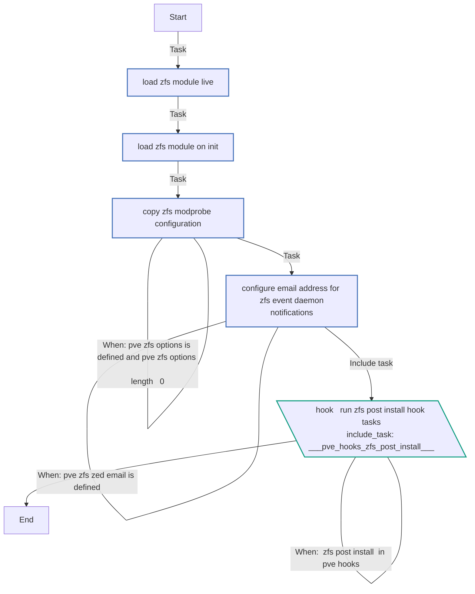


### Graph for identify_needed_packages.yml

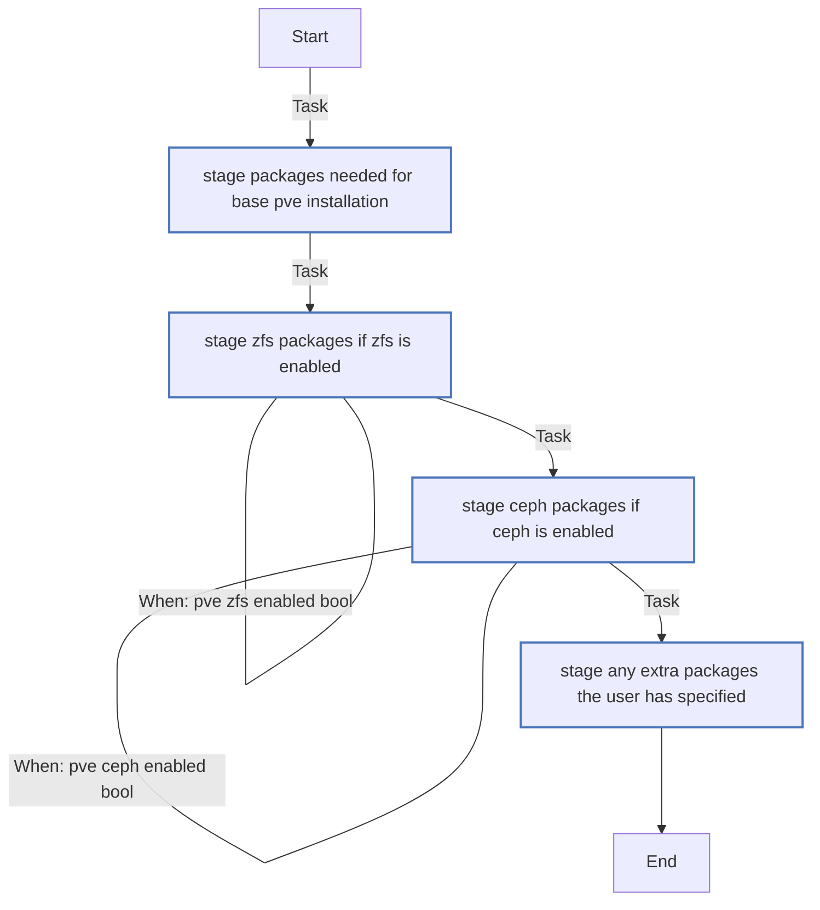


### Graph for disable_nmi_watchdog.yml

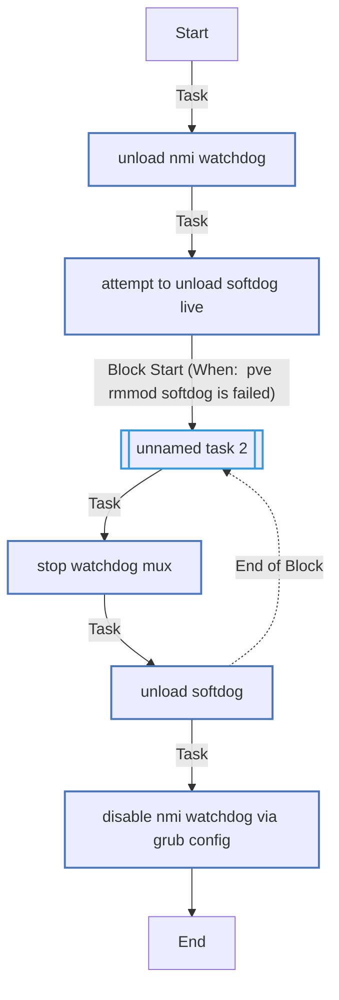


### Graph for realms_sync.yml

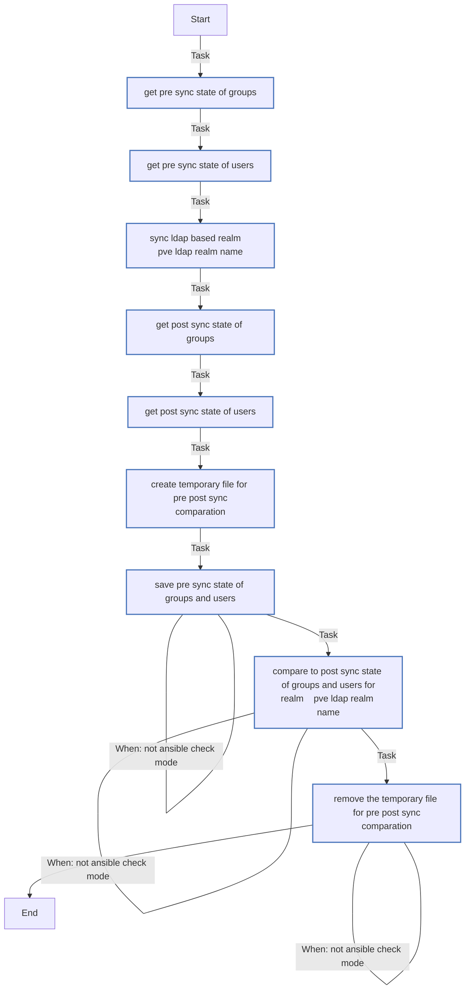


### Graph for ssh_cluster_config.yml

```mermaid
flowchart TD
Start
classDef block stroke:#3498db,stroke-width:2px;
classDef task stroke:#4b76bb,stroke-width:2px;
classDef include stroke:#2ecc71,stroke-width:2px;
classDef import stroke:#f39c12,stroke-width:2px;
classDef rescue stroke:#665352,stroke-width:2px;
classDef importPlaybook stroke:#9b59b6,stroke-width:2px;
classDef importTasks stroke:#34495e,stroke-width:2px;
classDef includeTasks stroke:#16a085,stroke-width:2px;
classDef importRole stroke:#699ba7,stroke-width:2px;
classDef includeRole stroke:#2980b9,stroke-width:2px;
classDef includeVars stroke:#8e44ad,stroke-width:2px;

  Start-->|Task| Create_SSH_directory_for_root0[create ssh directory for root]:::task
  Create_SSH_directory_for_root0-->|Task| Create_root_SSH_key_pair_for_PVE1[create root ssh key pair for pve]:::task
  Create_root_SSH_key_pair_for_PVE1-->|Task| Fetch_root_SSH_public_key2[fetch root ssh public key]:::task
  Fetch_root_SSH_public_key2-->|Task| Authorize_all_hosts__root_SSH_public_keys3[authorize all hosts  root ssh public keys]:::task
  Authorize_all_hosts__root_SSH_public_keys3-->|Task| Configure_SSH_clients_for_connecting_to_PVE_cluster_hosts4[configure ssh clients for connecting to pve<br>cluster hosts]:::task
  Configure_SSH_clients_for_connecting_to_PVE_cluster_hosts4-->|Task| Allow_root_logins_from_PVE_cluster_hosts5[allow root logins from pve cluster hosts]:::task
  Allow_root_logins_from_PVE_cluster_hosts5-->|Task| Enable_and_start_SSH_server6[enable and start ssh server]:::task
  Enable_and_start_SSH_server6-->|Task| Fetch_a_SSH_public_key_to_use_for_cluster_joins7[fetch a ssh public key to use for cluster joins]:::task
  Fetch_a_SSH_public_key_to_use_for_cluster_joins7-->|Task| Add_PVE_provided_ciphers_to_SSH_client_config8[add pve provided ciphers to ssh client config]:::task
  Add_PVE_provided_ciphers_to_SSH_client_config8-->End
```


### Graph for pve_add_node.yml

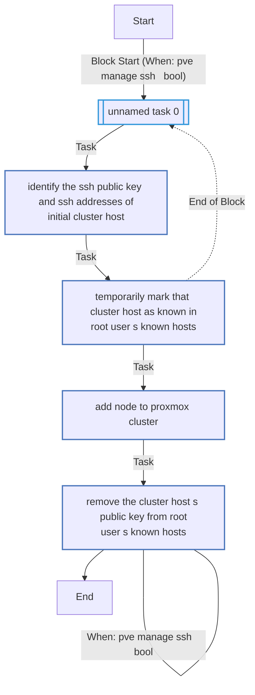


### Graph for load_variables.yml

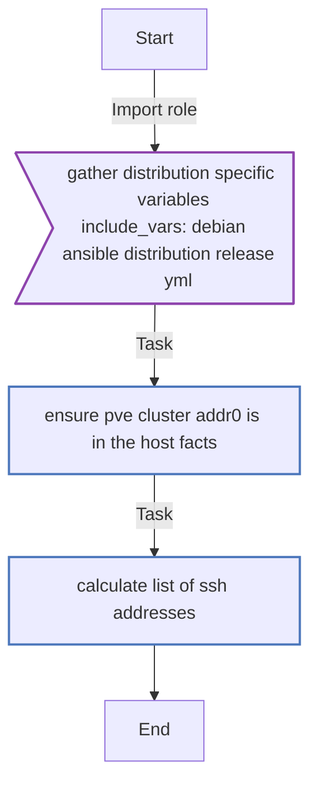


### Graph for ssl_config.yml

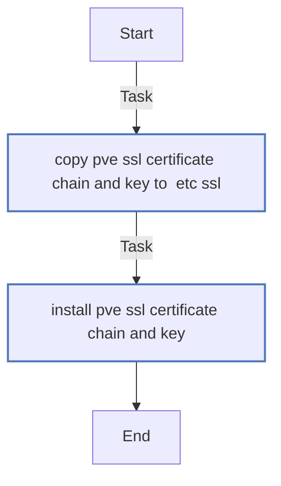


### Graph for pcie_passthrough.yml

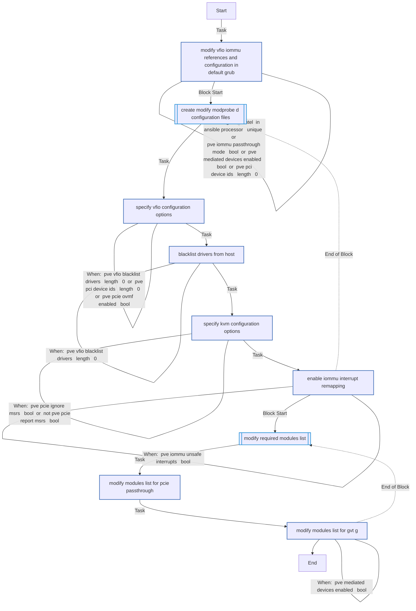


### Graph for ceph.yml

```mermaid
flowchart TD
Start
classDef block stroke:#3498db,stroke-width:2px;
classDef task stroke:#4b76bb,stroke-width:2px;
classDef include stroke:#2ecc71,stroke-width:2px;
classDef import stroke:#f39c12,stroke-width:2px;
classDef rescue stroke:#665352,stroke-width:2px;
classDef importPlaybook stroke:#9b59b6,stroke-width:2px;
classDef importTasks stroke:#34495e,stroke-width:2px;
classDef includeTasks stroke:#16a085,stroke-width:2px;
classDef importRole stroke:#699ba7,stroke-width:2px;
classDef includeRole stroke:#2980b9,stroke-width:2px;
classDef includeVars stroke:#8e44ad,stroke-width:2px;

  Start-->|"Block Start (When: inventory hostname    groups pve ceph mon group  0<br>)"| Unnamed_task_00_when_inventory_hostname____groups_pve_ceph_mon_group__0__block_start_0[[unnamed task 0]]:::block
  Unnamed_task_00_when_inventory_hostname____groups_pve_ceph_mon_group__0__block_start_0-->|Task| Create_initial_Ceph_config0[create initial ceph config]:::task
  Create_initial_Ceph_config0-->|Task| Create_initial_Ceph_monitor1[create initial ceph monitor]:::task
  Create_initial_Ceph_monitor1-->|Task| Fail_if_initial_monitor_creation_failed2_when__ceph_initial_mon_is_failed[fail if initial monitor creation failed]:::task
  Fail_if_initial_monitor_creation_failed2_when__ceph_initial_mon_is_failed---|When:  ceph initial mon is failed| Fail_if_initial_monitor_creation_failed2_when__ceph_initial_mon_is_failed
  Fail_if_initial_monitor_creation_failed2_when__ceph_initial_mon_is_failed-.->|End of Block| Unnamed_task_00_when_inventory_hostname____groups_pve_ceph_mon_group__0__block_start_0
  Fail_if_initial_monitor_creation_failed2_when__ceph_initial_mon_is_failed-->|Task| Create_additional_Ceph_monitors1_when_inventory_hostname____groups_pve_ceph_mon_group__0__AND_inventory_hostname_in_groups_pve_ceph_mon_group_[create additional ceph monitors]:::task
  Create_additional_Ceph_monitors1_when_inventory_hostname____groups_pve_ceph_mon_group__0__AND_inventory_hostname_in_groups_pve_ceph_mon_group_---|When: inventory hostname    groups pve ceph mon group  0<br> and inventory hostname in groups pve ceph mon<br>group | Create_additional_Ceph_monitors1_when_inventory_hostname____groups_pve_ceph_mon_group__0__AND_inventory_hostname_in_groups_pve_ceph_mon_group_
  Create_additional_Ceph_monitors1_when_inventory_hostname____groups_pve_ceph_mon_group__0__AND_inventory_hostname_in_groups_pve_ceph_mon_group_-->|Task| Create_additional_Ceph_managers2_when_inventory_hostname_in_groups_pve_ceph_mgr_group_[create additional ceph managers]:::task
  Create_additional_Ceph_managers2_when_inventory_hostname_in_groups_pve_ceph_mgr_group_---|When: inventory hostname in groups pve ceph mgr group | Create_additional_Ceph_managers2_when_inventory_hostname_in_groups_pve_ceph_mgr_group_
  Create_additional_Ceph_managers2_when_inventory_hostname_in_groups_pve_ceph_mgr_group_-->|Block Start| Unnamed_task_33_block_start_0[[unnamed task 3]]:::block
  Unnamed_task_33_block_start_0-->|Task| Query_for_existing_Ceph_volumes0[query for existing ceph volumes]:::task
  Query_for_existing_Ceph_volumes0-->|Task| Generate_a_list_of_active_OSDs1[generate a list of active osds]:::task
  Generate_a_list_of_active_OSDs1-->|Task| Generate_list_of_unprovisioned_OSDs2_when_item_device_not_in__existing_ceph_osds[generate list of unprovisioned osds]:::task
  Generate_list_of_unprovisioned_OSDs2_when_item_device_not_in__existing_ceph_osds---|When: item device not in  existing ceph osds| Generate_list_of_unprovisioned_OSDs2_when_item_device_not_in__existing_ceph_osds
  Generate_list_of_unprovisioned_OSDs2_when_item_device_not_in__existing_ceph_osds-->|Task| Create_Ceph_OSDs3[create ceph osds]:::task
  Create_Ceph_OSDs3-.->|End of Block| Unnamed_task_33_block_start_0
  Create_Ceph_OSDs3-->|"Block Start (When: inventory hostname    groups pve ceph mon group  0<br>)"| Unnamed_task_44_when_inventory_hostname____groups_pve_ceph_mon_group__0__block_start_0[[unnamed task 4]]:::block
  Unnamed_task_44_when_inventory_hostname____groups_pve_ceph_mon_group__0__block_start_0-->|Task| List_Ceph_CRUSH_rules0[list ceph crush rules]:::task
  List_Ceph_CRUSH_rules0-->|Task| Create_Ceph_CRUSH_rules1_when_item_name_not_in__ceph_crush_stdout_lines[create ceph crush rules]:::task
  Create_Ceph_CRUSH_rules1_when_item_name_not_in__ceph_crush_stdout_lines---|When: item name not in  ceph crush stdout lines| Create_Ceph_CRUSH_rules1_when_item_name_not_in__ceph_crush_stdout_lines
  Create_Ceph_CRUSH_rules1_when_item_name_not_in__ceph_crush_stdout_lines-->|Block Start| Unnamed_task_22_block_start_1[[unnamed task 2]]:::block
  Unnamed_task_22_block_start_1-->|Task| Download_and_decompress_crushmap0[download and decompress crushmap]:::task
  Download_and_decompress_crushmap0-->|Task| Modify_local_crushmap_for_rules_that_should_be_updated1[modify local crushmap for rules that should be<br>updated]:::task
  Modify_local_crushmap_for_rules_that_should_be_updated1-->|Task| Validate_and_compress_new_crushmap2_when__crushmap_changed[validate and compress new crushmap]:::task
  Validate_and_compress_new_crushmap2_when__crushmap_changed---|When:  crushmap changed| Validate_and_compress_new_crushmap2_when__crushmap_changed
  Validate_and_compress_new_crushmap2_when__crushmap_changed-->|Task| Upload_new_crushmap3_when__crushmap_changed_and__crushmap_valid_rc____0[upload new crushmap]:::task
  Upload_new_crushmap3_when__crushmap_changed_and__crushmap_valid_rc____0---|When:  crushmap changed and  crushmap valid rc    0| Upload_new_crushmap3_when__crushmap_changed_and__crushmap_valid_rc____0
  Upload_new_crushmap3_when__crushmap_changed_and__crushmap_valid_rc____0-->|Task| Cleanup_temp_files_from_generating_new_crushmap4[cleanup temp files from generating new crushmap]:::task
  Cleanup_temp_files_from_generating_new_crushmap4-.->|End of Block| Unnamed_task_22_block_start_1
  Cleanup_temp_files_from_generating_new_crushmap4-->|Task| List_Ceph_Pools3[list ceph pools]:::task
  List_Ceph_Pools3-->|Task| Create_Ceph_Pools4_when_item_name_not_in__ceph_pools_stdout_lines[create ceph pools]:::task
  Create_Ceph_Pools4_when_item_name_not_in__ceph_pools_stdout_lines---|When: item name not in  ceph pools stdout lines| Create_Ceph_Pools4_when_item_name_not_in__ceph_pools_stdout_lines
  Create_Ceph_Pools4_when_item_name_not_in__ceph_pools_stdout_lines-.->|End of Block| Unnamed_task_44_when_inventory_hostname____groups_pve_ceph_mon_group__0__block_start_0
  Create_Ceph_Pools4_when_item_name_not_in__ceph_pools_stdout_lines-->|Task| Create_Ceph_MDS_servers5_when_inventory_hostname_in_groups_pve_ceph_mds_group__and_pve_ceph_fs[create ceph mds servers]:::task
  Create_Ceph_MDS_servers5_when_inventory_hostname_in_groups_pve_ceph_mds_group__and_pve_ceph_fs---|When: inventory hostname in groups pve ceph mds group <br>and pve ceph fs| Create_Ceph_MDS_servers5_when_inventory_hostname_in_groups_pve_ceph_mds_group__and_pve_ceph_fs
  Create_Ceph_MDS_servers5_when_inventory_hostname_in_groups_pve_ceph_mds_group__and_pve_ceph_fs-->|Task| Wait_for_standby_MDS6_when__ceph_mds_create_is_changed[wait for standby mds]:::task
  Wait_for_standby_MDS6_when__ceph_mds_create_is_changed---|When:  ceph mds create is changed| Wait_for_standby_MDS6_when__ceph_mds_create_is_changed
  Wait_for_standby_MDS6_when__ceph_mds_create_is_changed-->|"Block Start (When: inventory hostname    groups pve ceph mon group  0<br>)"| Unnamed_task_77_when_inventory_hostname____groups_pve_ceph_mon_group__0__block_start_0[[unnamed task 7]]:::block
  Unnamed_task_77_when_inventory_hostname____groups_pve_ceph_mon_group__0__block_start_0-->|Task| List_Ceph_Filesystems0_when_pve_ceph_fs___length___0[list ceph filesystems]:::task
  List_Ceph_Filesystems0_when_pve_ceph_fs___length___0---|When: pve ceph fs   length   0| List_Ceph_Filesystems0_when_pve_ceph_fs___length___0
  List_Ceph_Filesystems0_when_pve_ceph_fs___length___0-->|Task| Create_Ceph_Filesystems1_when_item_name_not_in___ceph_fs_stdout___from_json___map_attribute__name___[create ceph filesystems]:::task
  Create_Ceph_Filesystems1_when_item_name_not_in___ceph_fs_stdout___from_json___map_attribute__name___---|When: item name not in   ceph fs stdout   from json  <br>map attribute  name   | Create_Ceph_Filesystems1_when_item_name_not_in___ceph_fs_stdout___from_json___map_attribute__name___
  Create_Ceph_Filesystems1_when_item_name_not_in___ceph_fs_stdout___from_json___map_attribute__name___-->|Task| Get_Ceph_Filesystem_pool_CRUSH_rules2_when_pve_ceph_fs___length___0[get ceph filesystem pool crush rules]:::task
  Get_Ceph_Filesystem_pool_CRUSH_rules2_when_pve_ceph_fs___length___0---|When: pve ceph fs   length   0| Get_Ceph_Filesystem_pool_CRUSH_rules2_when_pve_ceph_fs___length___0
  Get_Ceph_Filesystem_pool_CRUSH_rules2_when_pve_ceph_fs___length___0-->|Task| Set_Ceph_Filesystem_pool_CRUSH_rules3_when_item_item_0_rule_____item_stdout___from_json__crush_rule[set ceph filesystem pool crush rules]:::task
  Set_Ceph_Filesystem_pool_CRUSH_rules3_when_item_item_0_rule_____item_stdout___from_json__crush_rule---|When: item item 0 rule     item stdout   from json <br>crush rule| Set_Ceph_Filesystem_pool_CRUSH_rules3_when_item_item_0_rule_____item_stdout___from_json__crush_rule
  Set_Ceph_Filesystem_pool_CRUSH_rules3_when_item_item_0_rule_____item_stdout___from_json__crush_rule-->|Task| Create_Ceph_filesystem_key4_when_item_mountpoint_is_defined[create ceph filesystem key]:::task
  Create_Ceph_filesystem_key4_when_item_mountpoint_is_defined---|When: item mountpoint is defined| Create_Ceph_filesystem_key4_when_item_mountpoint_is_defined
  Create_Ceph_filesystem_key4_when_item_mountpoint_is_defined-.->|End of Block| Unnamed_task_77_when_inventory_hostname____groups_pve_ceph_mon_group__0__block_start_0
  Create_Ceph_filesystem_key4_when_item_mountpoint_is_defined-->|Task| Fetch_Ceph_filesystem_key8_when_item_mountpoint_is_defined[fetch ceph filesystem key]:::task
  Fetch_Ceph_filesystem_key8_when_item_mountpoint_is_defined---|When: item mountpoint is defined| Fetch_Ceph_filesystem_key8_when_item_mountpoint_is_defined
  Fetch_Ceph_filesystem_key8_when_item_mountpoint_is_defined-->|Task| Save_Ceph_filesystem_key9_when_item_is_changed[save ceph filesystem key]:::task
  Save_Ceph_filesystem_key9_when_item_is_changed---|When: item is changed| Save_Ceph_filesystem_key9_when_item_is_changed
  Save_Ceph_filesystem_key9_when_item_is_changed-->|Task| Mount_Ceph_filesystems10_when_item_mountpoint_is_defined[mount ceph filesystems]:::task
  Mount_Ceph_filesystems10_when_item_mountpoint_is_defined---|When: item mountpoint is defined| Mount_Ceph_filesystems10_when_item_mountpoint_is_defined
  Mount_Ceph_filesystems10_when_item_mountpoint_is_defined-->End
```


### Graph for ipmi_watchdog.yml

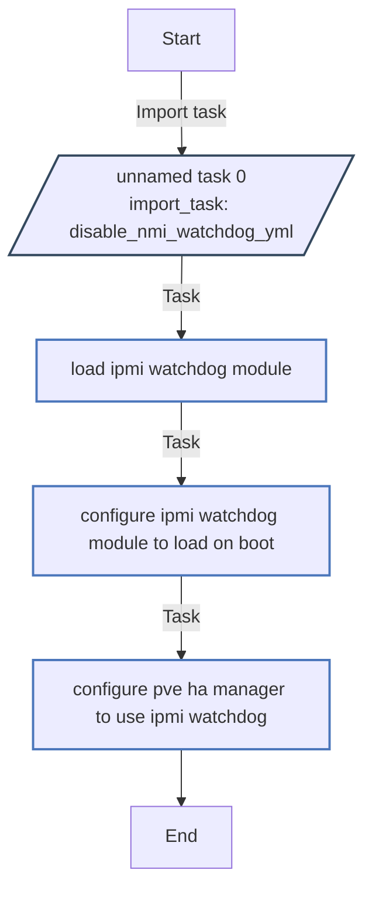


### Graph for realms_config.yml

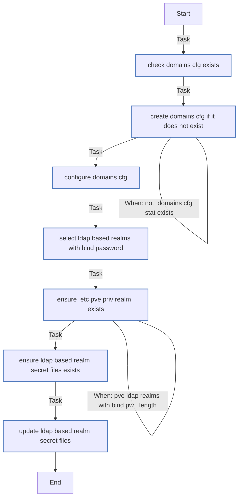


### Graph for pve_cluster_config.yml

```mermaid
flowchart TD
Start
classDef block stroke:#3498db,stroke-width:2px;
classDef task stroke:#4b76bb,stroke-width:2px;
classDef include stroke:#2ecc71,stroke-width:2px;
classDef import stroke:#f39c12,stroke-width:2px;
classDef rescue stroke:#665352,stroke-width:2px;
classDef importPlaybook stroke:#9b59b6,stroke-width:2px;
classDef importTasks stroke:#34495e,stroke-width:2px;
classDef includeTasks stroke:#16a085,stroke-width:2px;
classDef importRole stroke:#699ba7,stroke-width:2px;
classDef includeRole stroke:#2980b9,stroke-width:2px;
classDef includeVars stroke:#8e44ad,stroke-width:2px;

  Start-->|Task| Lookup_cluster_information0[lookup cluster information]:::task
  Lookup_cluster_information0-->|Task| Identify_if_the_host_is_already_part_of_a_cluster1_when__pve_cluster___json_query_query____ternary_true__false_[identify if the host is already part of a cluster]:::task
  Identify_if_the_host_is_already_part_of_a_cluster1_when__pve_cluster___json_query_query____ternary_true__false_---|When:  pve cluster   json query query    ternary true <br>false | Identify_if_the_host_is_already_part_of_a_cluster1_when__pve_cluster___json_query_query____ternary_true__false_
  Identify_if_the_host_is_already_part_of_a_cluster1_when__pve_cluster___json_query_query____ternary_true__false_-->|Task| Identify_all_clusters_that_the_hosts_in_the_specified_group_may_be_in2_when___pve_active_cluster__in_hostvars_item_[identify all clusters that the hosts in the<br>specified group may be in]:::task
  Identify_all_clusters_that_the_hosts_in_the_specified_group_may_be_in2_when___pve_active_cluster__in_hostvars_item_---|When:   pve active cluster  in hostvars item | Identify_all_clusters_that_the_hosts_in_the_specified_group_may_be_in2_when___pve_active_cluster__in_hostvars_item_
  Identify_all_clusters_that_the_hosts_in_the_specified_group_may_be_in2_when___pve_active_cluster__in_hostvars_item_-->|Task| Ensure_that_hosts_found_are_not_in_multiple_existing_clusters3[ensure that hosts found are not in multiple<br>existing clusters]:::task
  Ensure_that_hosts_found_are_not_in_multiple_existing_clusters3-->|Task| Ensure_that__if_we_find_an_existing_cluster__that_it_matches_the_specified_cluster_name4_when___pve_found_clusters___default_______length_____1[ensure that  if we find an existing cluster  that<br>it matches the specified cluster name]:::task
  Ensure_that__if_we_find_an_existing_cluster__that_it_matches_the_specified_cluster_name4_when___pve_found_clusters___default_______length_____1---|When:   pve found clusters   default       length     1| Ensure_that__if_we_find_an_existing_cluster__that_it_matches_the_specified_cluster_name4_when___pve_found_clusters___default_______length_____1
  Ensure_that__if_we_find_an_existing_cluster__that_it_matches_the_specified_cluster_name4_when___pve_found_clusters___default_______length_____1-->|Task| Default_initialization_node_is_the_first_node_of_pve_group5[default initialization node is the first node of<br>pve group]:::task
  Default_initialization_node_is_the_first_node_of_pve_group5-->|Task| Find_any_active_node_in_an_already_initialized_Proxmox_cluster6_when___pve_active_cluster__in_hostvars_item__AND_hostvars_item____pve_active_cluster______pve_cluster_clustername[find any active node in an already initialized<br>proxmox cluster]:::task
  Find_any_active_node_in_an_already_initialized_Proxmox_cluster6_when___pve_active_cluster__in_hostvars_item__AND_hostvars_item____pve_active_cluster______pve_cluster_clustername---|When:   pve active cluster  in hostvars item  and<br>hostvars item    pve active cluster      pve<br>cluster clustername| Find_any_active_node_in_an_already_initialized_Proxmox_cluster6_when___pve_active_cluster__in_hostvars_item__AND_hostvars_item____pve_active_cluster______pve_cluster_clustername
  Find_any_active_node_in_an_already_initialized_Proxmox_cluster6_when___pve_active_cluster__in_hostvars_item__AND_hostvars_item____pve_active_cluster______pve_cluster_clustername-->|Task| Initialize_a_Proxmox_cluster7_when__pve_found_clusters_is_not_defined_AND_inventory_hostname_____init_node[initialize a proxmox cluster]:::task
  Initialize_a_Proxmox_cluster7_when__pve_found_clusters_is_not_defined_AND_inventory_hostname_____init_node---|When:  pve found clusters is not defined and inventory<br>hostname     init node| Initialize_a_Proxmox_cluster7_when__pve_found_clusters_is_not_defined_AND_inventory_hostname_____init_node
  Initialize_a_Proxmox_cluster7_when__pve_found_clusters_is_not_defined_AND_inventory_hostname_____init_node-->|Task| Wait_for_quorum_on_initialization_node8_when_inventory_hostname_____init_node[wait for quorum on initialization node]:::task
  Wait_for_quorum_on_initialization_node8_when_inventory_hostname_____init_node---|When: inventory hostname     init node| Wait_for_quorum_on_initialization_node8_when_inventory_hostname_____init_node
  Wait_for_quorum_on_initialization_node8_when_inventory_hostname_____init_node-->|Include task| pve_add_node_yml9[\unnamed task 9<br>include_task: pve_add_node_yml\]:::includeTasks
  pve_add_node_yml9---|When:  pve active cluster is not defined and inventory<br>hostname     init node| pve_add_node_yml9
  pve_add_node_yml9-->|Task| Check_for_PVE_cluster_HA_groups10_when_inventory_hostname_____init_node[check for pve cluster ha groups]:::task
  Check_for_PVE_cluster_HA_groups10_when_inventory_hostname_____init_node---|When: inventory hostname     init node| Check_for_PVE_cluster_HA_groups10_when_inventory_hostname_____init_node
  Check_for_PVE_cluster_HA_groups10_when_inventory_hostname_____init_node-->|Task| Create_PVE_cluster_HA_groups11_when_inventory_hostname_____init_node_AND_item_name_not_in__ha_group_list_response___json_query______group__[create pve cluster ha groups]:::task
  Create_PVE_cluster_HA_groups11_when_inventory_hostname_____init_node_AND_item_name_not_in__ha_group_list_response___json_query______group__---|When: inventory hostname     init node and item name not<br>in  ha group list response   json query      group<br> | Create_PVE_cluster_HA_groups11_when_inventory_hostname_____init_node_AND_item_name_not_in__ha_group_list_response___json_query______group__
  Create_PVE_cluster_HA_groups11_when_inventory_hostname_____init_node_AND_item_name_not_in__ha_group_list_response___json_query______group__-->|Task| Update_PVE_cluster_HA_groups12_when_inventory_hostname_____init_node_AND_item_0_name_in__ha_group_list_response___json_query______group___AND_item_1_in_item_0_AND_item_0_item_1______ha_group_list_response___json_query____group_______item_0_name___________item_1____first[update pve cluster ha groups]:::task
  Update_PVE_cluster_HA_groups12_when_inventory_hostname_____init_node_AND_item_0_name_in__ha_group_list_response___json_query______group___AND_item_1_in_item_0_AND_item_0_item_1______ha_group_list_response___json_query____group_______item_0_name___________item_1____first---|When: inventory hostname     init node and item 0 name<br>in  ha group list response   json query      group<br>  and item 1 in item 0 and item 0 item 1      ha<br>group list response   json query    group      <br>item 0 name           item 1    first| Update_PVE_cluster_HA_groups12_when_inventory_hostname_____init_node_AND_item_0_name_in__ha_group_list_response___json_query______group___AND_item_1_in_item_0_AND_item_0_item_1______ha_group_list_response___json_query____group_______item_0_name___________item_1____first
  Update_PVE_cluster_HA_groups12_when_inventory_hostname_____init_node_AND_item_0_name_in__ha_group_list_response___json_query______group___AND_item_1_in_item_0_AND_item_0_item_1______ha_group_list_response___json_query____group_______item_0_name___________item_1____first-->End
```


## Playbook

```yml
---
- name: Deploy/configure PVE-Cluster
  hosts: physiHA
  become: true
  become_method: ansible.builtin.sudo
  roles:
    - role: tmueller.pvenetconf
    - role: lae.proxmox

```
## Playbook graph
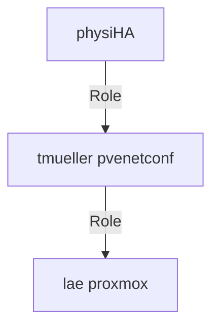

## Author Information
Musee Ullah

#### License

MIT

#### Minimum Ansible Version

2.9

#### Platforms

- **Debian**: ['buster', 'bullseye', 'bookworm']

<!-- DOCSIBLE END -->
